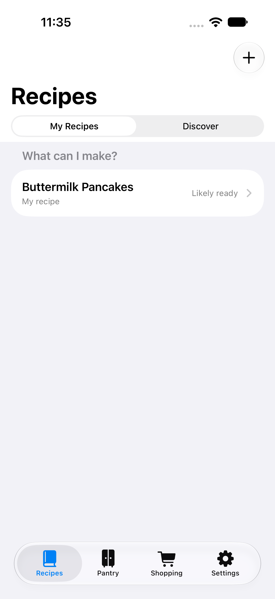
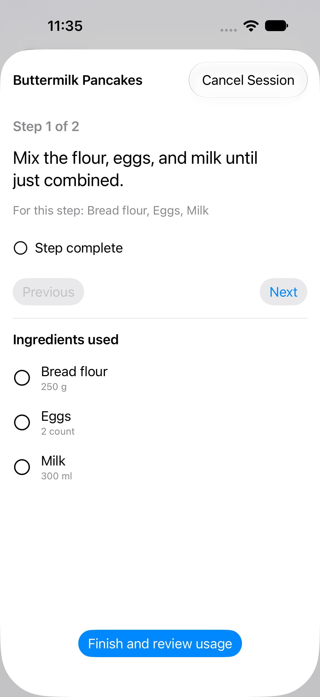
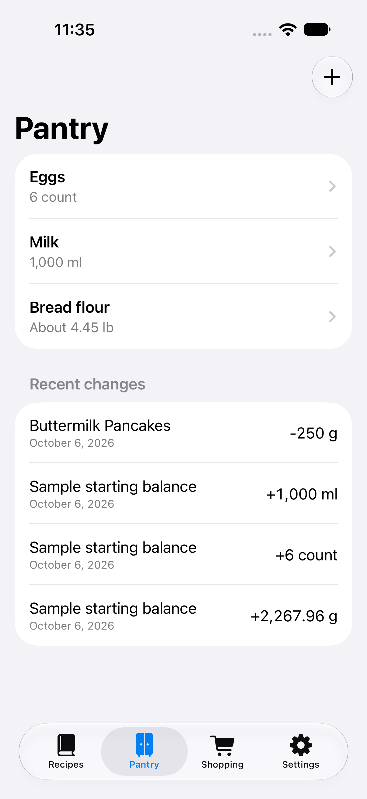
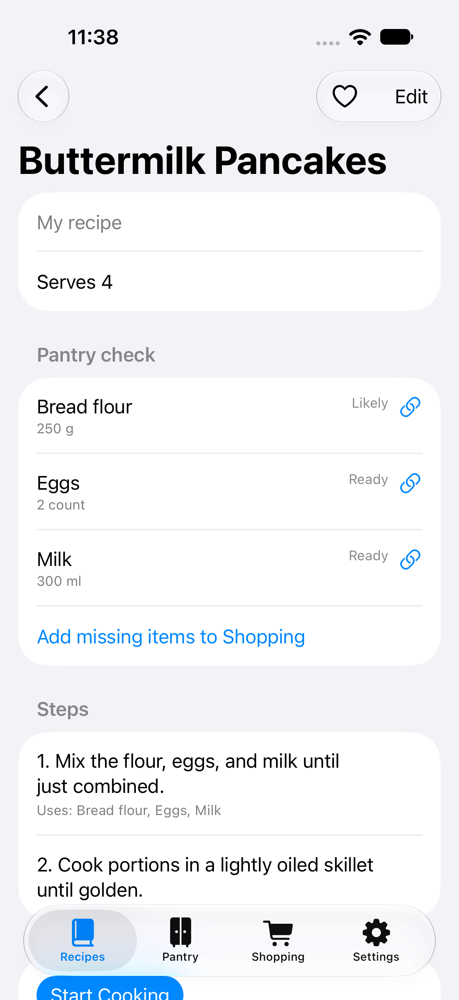
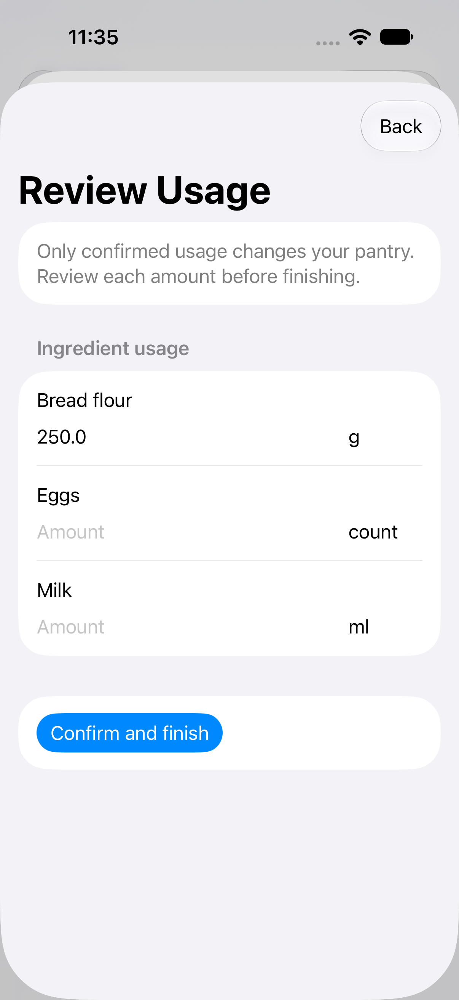
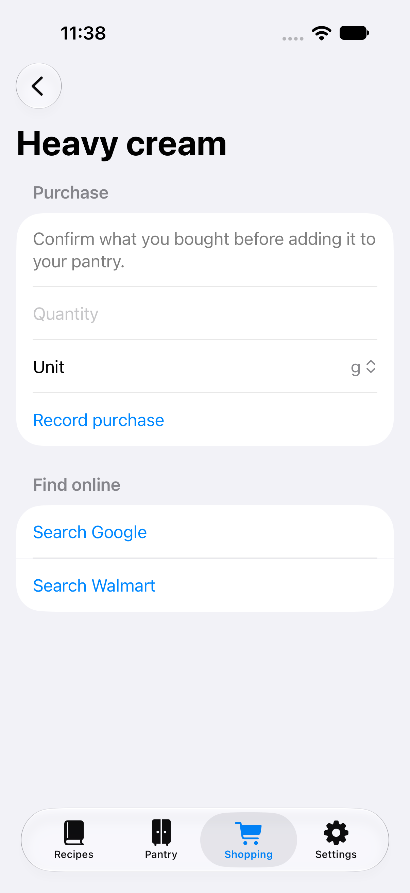
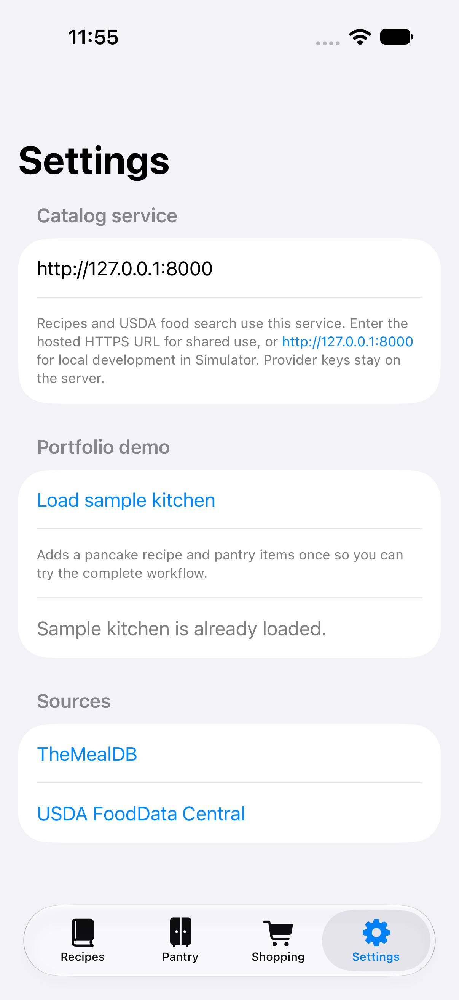

# Cooking Companion

Cooking Companion is a native iPhone app for the full kitchen loop: find a recipe, check what is on hand, shop for what is missing, cook, confirm what was used, and see the updated pantry. It uses **TheMealDB** for recipe discovery and **USDA FoodData Central** for optional food and nutrition details through a small shared FastAPI service. Recipes, quantities, shopping items, and cooking history belong to the app and persist locally with SwiftData.

| My Recipes | Guided cooking | Pantry and history |
| --- | --- | --- |
|  |  |  |

| Recipe check | Usage confirmation | Shopping |
| --- | --- | --- |
|  |  |  |

These are captures from the iPhone 18 Pro simulator using the included sample kitchen. The [Figma product and UX file](https://www.figma.com/design/2VrGZrTryO0BAjVjlaXqpQ) contains the flows, wireframes, components, light/dark exploration, and interactive prototype.

## What the app does

- **Find and own recipes.** Search TheMealDB by name, browse categories, or filter by one ingredient. Saving turns a remote result into a complete editable local recipe with its original measures, instructions, image, source link, and provider ID. Create recipes manually and mark favorites, too.
- **Check the pantry honestly.** Track an exact quantity, an estimate, or simply whether an item is available. Recipe ingredients show **Ready**, **Likely**, **Missing**, or **Needs Review**. Grams, milliliters, and counts are kept separate; cross-dimension conversions require a value you explicitly enter for that ingredient.
- **Cook without losing your place.** A cooking session snapshots the recipe and saves step and ingredient checklist progress. Checking an ingredient proposes usage; it does not reduce stock. Review and edit quantities before finishing. Confirmation records the consumption and inventory history once, and an unfinished session can be resumed.
- **Shop and replenish.** Add known recipe shortages, low-stock suggestions, or manual items. Compatible shortages merge without multiplying when generated again. Confirm the purchased quantity to add it to the pantry, or open Google and Walmart searches from the item detail.
- **Optionally enrich ingredients.** Search USDA foods, confirm a match, and cache the food ID and nutrient values with their units and measurement basis. Food matching is separate from the app's own ingredient identity.

Saved recipes, pantry, shopping, and cooking continue to work when the internet or catalog service is unavailable. New recipe discovery and USDA searches need the service.

## API keys and shared service

The iPhone talks to one HTTPS service at `https://cooking-companion-api-enmanuels-projects-5c99349f.vercel.app`. That service calls TheMealDB V2 and USDA. **Both provider keys stay in the service environment, never in Swift source, the app's Settings, screenshots, or GitHub.** New installations use the hosted service URL by default.

| Environment | Where the two keys go | Used for |
| --- | --- | --- |
| Local development | In the ignored `.env` file at the repository root: `FOODDATA_API_KEY=...` and `THEMEALDB_API_KEY=...`. | FastAPI loads these when it starts on your Mac. |
| Hosted service | In the hosting project's **Secret environment variables**, using the same two names. | The host supplies them to FastAPI; update them in the hosting dashboard and redeploy. |

TheMealDB's [API instructions](https://www.themealdb.com/api.php) show the V2 URL format. USDA's [API guide](https://fdc.nal.usda.gov/api-guide/) requires protecting its key. Paste each **key alone**, not a full provider URL. A missing key makes only that provider's new searches unavailable; saved local data still works.



For local development, open Terminal in this repository's folder and run **one command at a time**. First create the Python environment:

```sh
python3 -m venv .venv
```

Then install the backend packages into it:

```sh
.venv/bin/python -m pip install -r backend/requirements.txt
```

Copy the key template if `.env` does not already exist:

```sh
cp -n .env.example .env
```

Open `.env` in an editor and replace the placeholders with your two keys. If you already created `.env`, add `THEMEALDB_API_KEY=your_actual_key` on a new line. These are lines **inside the file**, not Terminal commands or arguments to `venv`. Start the service with:

```sh
.venv/bin/uvicorn app:app --host 0.0.0.0 --port 8000
```

`.env` is ignored by Git. Restart the local service after changing either key. To use the local service in Simulator, change **Settings → API service URL** to `http://127.0.0.1:8000`. For local testing on a physical iPhone, enter your Mac's Wi-Fi address, such as `http://192.168.1.20:8000`, while the phone and Mac share a network. The local HTTP allowance exists only in the Debug app configuration.

### Hosting on Vercel

The repository includes a root FastAPI entrypoint and requirements file for [Vercel's FastAPI runtime](https://vercel.com/docs/frameworks/backend/fastapi). The Vercel project is `cooking-companion-api`, linked to this repository at the repository root. Add `FOODDATA_API_KEY` and `THEMEALDB_API_KEY` as **Secret** variables for Production in **Project Settings → Environment Variables**. Deploy, then check the hosted `/health` endpoint: it returns HTTP 200 only when both keys are configured. New installations already use the production base URL; existing devices can set it in **Settings → API service URL**. Update either key in Vercel's environment settings and redeploy; old deployments do not receive changed values. [Vercel environment-variable guide](https://vercel.com/docs/environment-variables/)

The service exposes `GET /recipes/search?q=…`, `/recipes/categories`, `/recipes/filter?category=…` or `?ingredient=…`, `/recipes/{mealId}`, `/foods/search?q=…&page=…`, and `/foods/{fdcId}`. It has no endpoint that accepts arbitrary provider URLs or returns credentials.

The public endpoints are deliberately limited to recipe search, categories, one-filter search, recipe details, USDA food search, and USDA food details. Successful catalog responses have a one-hour CDN cache header. Before opening the service to a broad audience, configure a [host-level rate limit](https://vercel.com/docs/vercel-firewall/vercel-waf/custom-rules); USDA's [default limit is 1,000 requests per hour per IP](https://fdc.nal.usda.gov/api-guide/). App data remains on each device; this service does not provide accounts or sync.

## Run the app

1. Open `CookingCompanion.xcodeproj` in Xcode and select the `CookingCompanion` scheme. The app targets iOS 17 or newer.
2. Run on an iPhone Simulator. In **Settings**, tap **Load sample kitchen** to add a pancake recipe, flour, eggs, and milk once.
3. Open **Recipes → Buttermilk Pancakes** to see the pantry check. Start cooking, check flour, review the proposed amount, and confirm. **Pantry** will show the new balance and a signed transaction.
4. To run on your iPhone, connect and unlock it, trust the Mac if prompted, select the device in Xcode, use your Apple Development team in **Signing & Capabilities**, and run. Free Personal Team provisioning may require a new build after seven days.

The generated Xcode project is committed. `project.yml` is its [XcodeGen](https://github.com/yonaskolb/XcodeGen) source if the project structure changes.

## Architecture and tests

TheMealDB and USDA responses pass through the shared FastAPI service, then map into local `Recipe` and `Ingredient` records. SwiftData owns inventory transactions, shopping, and resumable cooking sessions. See the [architecture](docs/architecture.md) and [UX decisions](docs/design.md) for the data model and interaction choices.

```sh
DEVELOPER_DIR=/Applications/Xcode.app/Contents/Developer xcodebuild -project CookingCompanion.xcodeproj -scheme CookingCompanion -destination 'platform=iOS Simulator,name=iPhone 17' CODE_SIGNING_ALLOWED=NO test
.venv/bin/python -m unittest discover -s backend -p 'test_*.py' -v
```

GitHub Actions runs the backend tests and Debug/Release iOS simulator builds on pushes to `main`.
